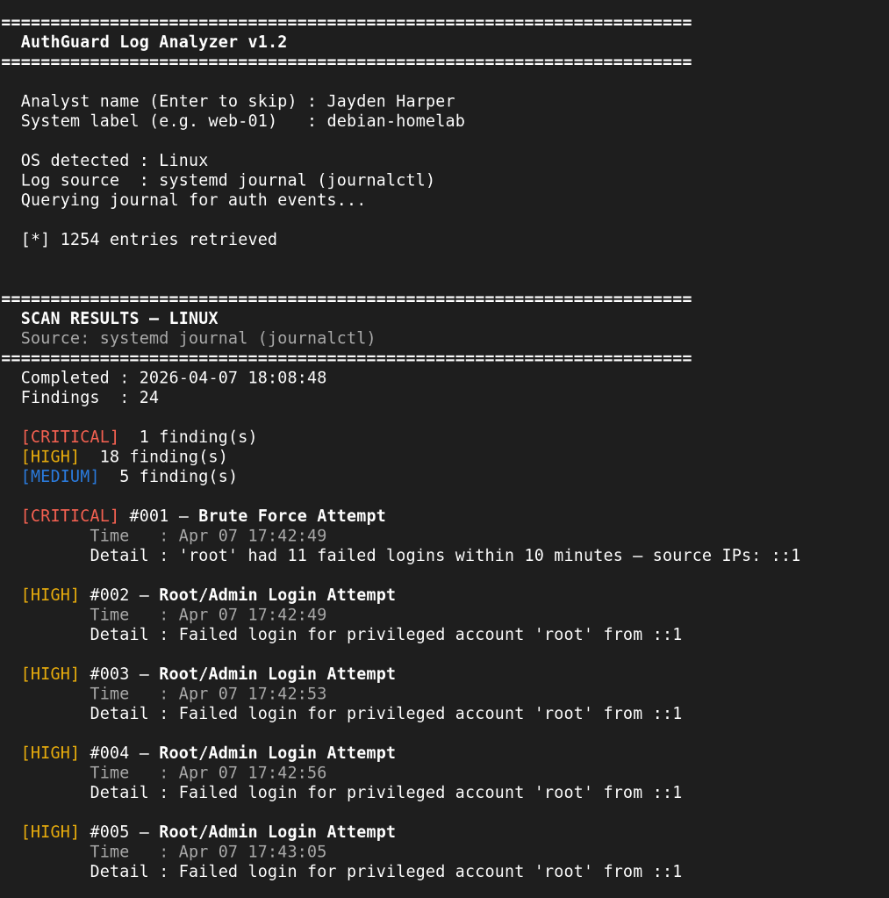

# AuthGuard Log Analyzer

A cross-platform authentication log analysis tool built for SOC use. Parses Linux auth logs and Windows Security Event Logs to detect suspicious authentication behavior and generate professional incident reports.

---

## What It Does

AuthGuard scans system authentication logs and automatically flags 10 categories of suspicious activity — the same patterns real SOC analysts look for daily.

| # | Detection | Severity |
|---|-----------|----------|
| 1 | Brute Force Attempts | CRITICAL |
| 2 | Successful Login After Multiple Failures | CRITICAL |
| 3 | Logins at Unusual Hours | HIGH / MEDIUM |
| 4 | New / Unknown User Login | MEDIUM |
| 5 | Credential Stuffing (Multi-IP per User) | HIGH |
| 6 | Root / Admin Login Attempts | HIGH |
| 7 | Logins from Unknown IPs | MEDIUM |
| 8 | Account Lockouts | HIGH |
| 9 | Privilege Escalation Attempts (sudo / Event 4672) | HIGH |
| 10 | SSH Anomalies (invalid users, pre-auth scans) | MEDIUM |

---

## Features

- **Auto-detects OS** - no flags or arguments needed. Routes to Linux (`/var/log/auth.log`) or Windows Security Event Log automatically.
- **Memory-efficient** - reads logs line-by-line using generators. Handles large production logs without loading them fully into memory.
- **Single O(n) pass** - one read through the file, all detections evaluated simultaneously.
- **Colorized terminal output** - severity-coded findings printed inline as the scan completes.
- **Professional report file** - auto-generated `.txt` report with executive summary, detailed findings, and recommendations. Follows SOC documentation standards.
- **Tunable thresholds** - brute force sensitivity, business hours window, and baseline users/IPs are all configurable at the top of the script.

---

## Usage

```bash
# Clone the repo
git clone https://github.com/yourusername/authguard-log-analyzer.git
cd authguard-log-analyzer

# Run against your system logs (Linux/macOS — may need sudo for /var/log/auth.log)
python3 log_analyzer.py

# Or run against the included sample log to see it in action
# (Edit log_source in main() to point to sample_auth.log)
python3 log_analyzer.py
```

**Windows** — requires `pywin32`:
```bash
pip install pywin32
python log_analyzer.py
```

---

## Sample Output

```
======================================================================
  AUTHGUARD LOG ANALYZER — LINUX
======================================================================
  Scan completed at: 2026-04-01 14:33:02
  Total findings:    9

  [CRITICAL] Finding #001 — Brute Force Attempt
             Time   : Apr  1 02:14:01
             Detail : User 'root' had 6 failed login attempts within a
                      10-minute window. Source IPs: 203.0.113.45

  [CRITICAL] Finding #002 — Successful Login After Multiple Failures
             Time   : Apr  1 02:14:13
             Detail : User 'root' logged in successfully from 203.0.113.45
                      after 6 prior failure(s). Possible credential compromise.
...
```

A full `.txt` report is generated automatically in the same directory.



---

## Configuration

At the top of `log_analyzer.py`, adjust these constants:

```python
BRUTE_FORCE_THRESHOLD      = 5    # failures to trigger brute force alert
BRUTE_FORCE_WINDOW_MINUTES = 10   # time window for brute force detection
NORMAL_HOURS_START         = 7    # business hours start (24h)
NORMAL_HOURS_END           = 20   # business hours end (24h)
KNOWN_USERS = {"root", "admin"}   # expected accounts on this system
KNOWN_IPS   = {"127.0.0.1"}       # trusted IP addresses
```

---

## Skills

- Python (regex, generators, defaultdict, datetime arithmetic)
- Linux system administration & log structure
- Windows Event Log parsing
- SOC detection logic & threshold-based alerting
- Incident report documentation
- Cross-platform software design

---

## Sample Log

A realistic fake `sample_auth.log` is included for testing and demo purposes. It contains examples of every detection type the tool flags.

---

## Future Improvements

- [ ] Geolocation lookup for flagged IPs (MaxMind GeoLite2)
- [ ] SIEM integration (Elastic/Splunk forwarder)
- [ ] Threat intel feed matching (AbuseIPDB API)
- [ ] HTML report output
- [ ] Email alerting on CRITICAL findings

---
